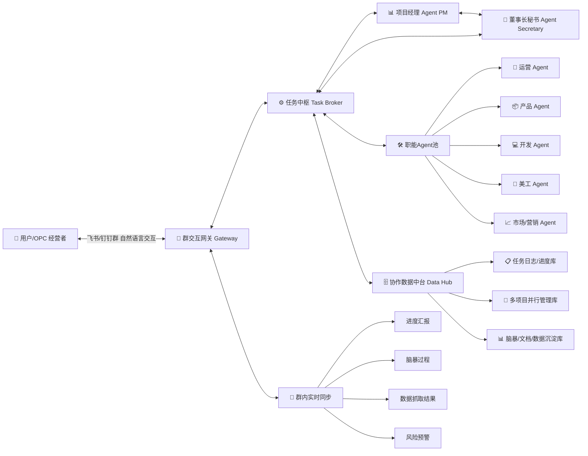
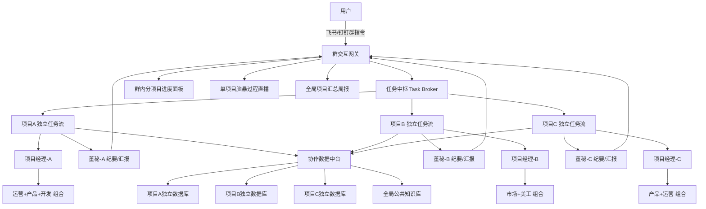
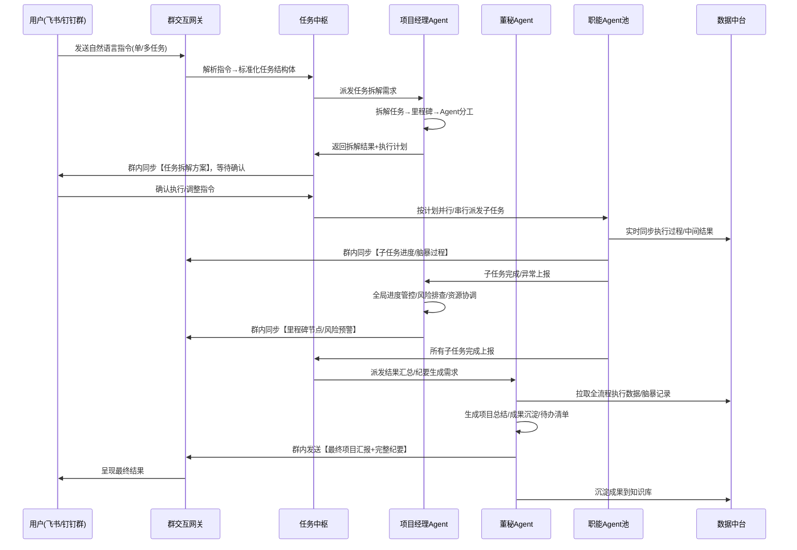
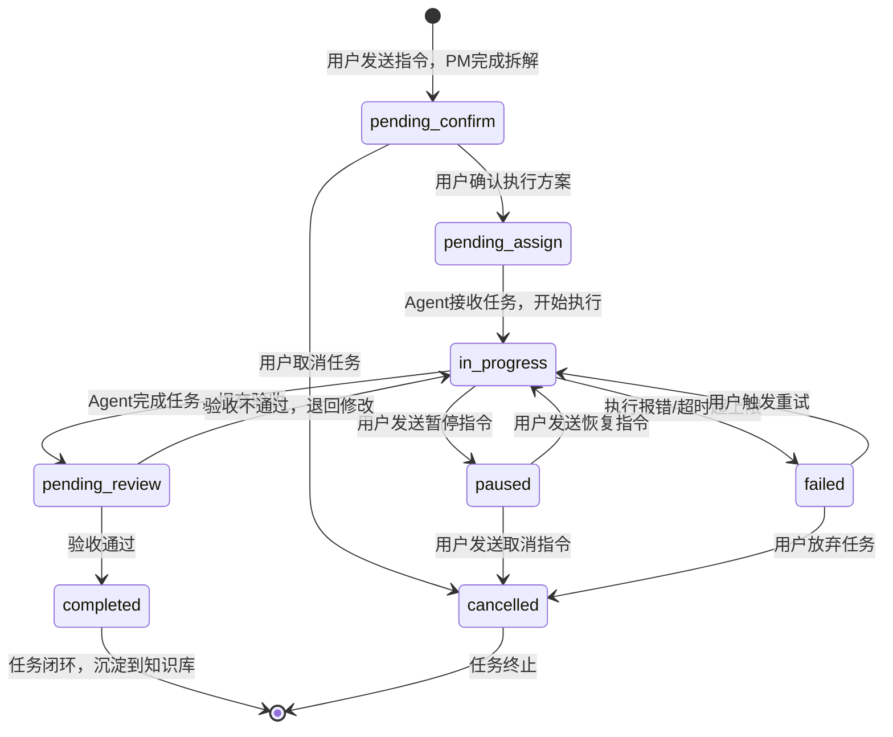

# Nick - 一人公司/轻团队 飞书/钉钉专属 AI 协作Agent系统

<p align="center">
  
  
  
</p>

## 📋 项目简介

Nick 是一款专为**一人公司（OPC）、独立开发者、微型创业团队**打造的，跑在飞书/钉钉群内的多Agent协作系统。

以「用户为绝对核心，虚拟职能团队为执行载体」，通过轻量化的层级架构，实现多Agent并行协作、任务全流程管控、群内实时进度同步、脑暴过程全透明，帮你用一个群，搞定产品、运营、开发、市场、美工全链路工作，真正实现「一人成军」。

## ✨ 核心特性

- 🎯 **精准职能Agent池**：专属运营、产品、开发、美工、市场/营销Agent，无冗余功能，开箱即用
- 📊 **双核心管控角色**：内置项目经理+董事长秘书，自动拆任务、抓进度、写汇报、记纪要，解放你的精力
- ⚡ **多项目并行架构**：支持同时推进N个项目，每个项目独立管控、资源隔离、互不干扰
- 📱 **飞书/钉钉原生适配**：所有交互、进度汇报、脑暴、数据抓取全在群内完成，无需切换平台
- 🔄 **全流程状态管控**：内置标准化任务状态机，任务全链路可追踪、可管控、可回溯
- 🗄️ **统一协作数据中台**：所有项目成果、脑暴记录、执行数据自动沉淀，构建专属知识库
- 🛡️ **企业级可靠性**：内置超时重试、故障隔离、审计日志、权限管控，稳定不掉线

## 🏛️ 核心架构



### 多项目并行专项架构



## 📦 模块分工与核心职责

### 1. 群交互网关 Gateway

- 飞书/钉钉群唯一交互入口，接收用户所有自然语言指令
- 指令解析、意图识别、权限校验，屏蔽底层复杂调度逻辑
- 负责群内消息的发送、卡片渲染、按钮交互回调处理
- 适配飞书/钉钉开放平台原生能力，开箱即用

### 2. 任务中枢 Task Broker

- 系统核心调度引擎，负责多项目并行管理、任务全生命周期管控
- 任务拆解、分配、调度、状态流转，内置标准化任务状态机
- 故障隔离、超时重试、熔断降级，保障多项目并行稳定
- 统一收口所有Agent的执行结果，协调跨Agent协作

### 3. 项目经理 Agent PM

- 项目总负责人，深度理解用户意图，拆解任务、制定执行计划
- 排期规划、里程碑设定、多Agent资源协调、进度管控
- 风险识别、预警、排查，保障项目按时按质完成
- 群内里程碑汇报、进度同步、问题同步，让用户随时掌控全局

### 4. 董事长秘书 Agent Secretary

- 全流程记录员，自动记录脑暴过程、群内讨论、任务执行细节
- 项目结束后自动生成完整汇报、执行纪要、成果清单
- 抓取群内文档、聊天记录、数据，自动提炼核心要点
- 沉淀项目成果到数据中台，构建用户专属知识库

### 5. 职能Agent池（核心执行层）

| Agent名称 | 核心职责 | 高频适用场景 |
|-----------|---------|-------------|
| 运营 Agent | 活动策划、内容排期、用户运营方案、运营周报、社群数据复盘 | 618/双11活动策划、小红书/抖音内容排期、社群运营方案 |
| 产品 Agent | PRD文档撰写、需求拆解、产品流程图、功能规划、竞品产品分析 | 新品功能设计、需求文档输出、产品迭代规划 |
| 开发 Agent | 代码编写、架构设计、技术方案评审、bug排查、接口设计、部署方案 | 官网开发、功能接口编写、技术方案输出、bug修复 |
| 美工 Agent | 海报设计、UI设计、封面图制作、视觉素材生成、品牌视觉规范 | 活动海报、产品UI、公众号封面、短视频封面设计 |
| 市场/营销 Agent | 市场调研、竞品分析、营销方案、品牌定位、投放策略、文案撰写 | 竞品调研、品牌slogan脑暴、投放方案、营销话术撰写 |

### 6. 协作数据中台 Data Hub

- 系统统一数据底座，所有项目、任务、Agent数据统一存储
- 多项目数据隔离，授权共享，避免数据孤岛
- 全量审计日志留存，所有操作可追溯、可复盘
- 知识库管理，自动沉淀项目成果，支持历史内容复用

## 🔄 核心流程

### 1. 核心主流程（用户指令→执行→汇报全链路）



### 2. 单任务专项执行流程

1. **触发**：用户在群内@对应Agent 或 发送单任务指令（例："@美工Agent 做一张新品活动海报"）

2. **网关接收**：校验用户权限→解析指令→提取核心需求→生成标准化单任务

3. **任务中枢调度**：直接派发任务给对应职能Agent，同步抄送项目经理&董秘

4. **执行过程**：
   - 职能Agent接收任务→群内回复【任务已接收，预计XX时间完成】
   - 执行中实时同步进度（例："初稿已完成，请查收"）
   - 接收用户反馈→迭代优化

5. **收尾**：任务完成→董秘自动生成执行纪要→沉淀到数据中台→群内同步【任务已完成】

### 3. 多项目并行执行流程

1. **触发**：用户发送多项目指令（例："同时推进3件事：1. 新品上线项目 2. 竞品调研项目 3. 618活动策划"）

2. **网关接收**：解析指令→拆分出3个独立项目→生成项目唯一ID

3. **任务中枢调度**：
   - 为每个项目分配独立的项目经理&董秘（资源隔离）
   - 每个项目独立拆解任务、分配Agent、管控进度
   - 全局项目互不干扰，支持不同优先级调度

4. **群内同步规则**：
   - 每个项目单独生成【进度卡片】，分栏展示
   - 里程碑节点单独@用户汇报，日常进度汇总播报
   - 支持用户单独@某项目的PM/Agent，单独沟通该项目事宜

5. **收尾**：每个项目独立完成验收→独立生成汇报→全局每周生成多项目汇总周报

### 4. 多Agent脑暴协作流程

1. **触发**：用户发送脑暴指令（例："所有人来脑暴一下新品牌slogan，产品、运营、市场、美工都参与"）

2. **网关接收**：解析脑暴主题→确定参与Agent→生成脑暴任务

3. **任务中枢调度**：
   - 项目经理主持脑暴，设定规则、轮次、时长
   - 董秘全程记录，同步整理发言要点
   - 按顺序/并行模式，触发各Agent输出观点

4. **群内执行**：
   - 项目经理开场→明确脑暴主题与规则
   - 各Agent依次在群内输出观点，可互相引用、反驳、补充
   - 项目经理控场，引导方向，避免跑题
   - 董秘实时同步【脑暴要点清单】到群内

5. **收尾**：脑暴结束→董秘生成完整脑暴纪要+结论清单+待落地任务→项目经理派发后续执行任务→群内同步最终结果

## 📊 任务状态机

### 核心状态定义（全项目通用，支持并行隔离）

| 状态名称 | 状态编码 | 核心含义 | 触发场景 |
|---------|---------|---------|---------|
| 待确认 | pending_confirm | 任务已拆解，等待用户确认执行方案 | 用户发送指令后，PM完成拆解，待用户确认 |
| 待分配 | pending_assign | 任务已确认，等待分配给对应Agent | 用户确认执行方案后，待PM分配子任务 |
| 执行中 | in_progress | Agent正在执行任务，过程可追踪 | Agent接收任务，开始执行 |
| 待审核 | pending_review | 子任务完成，等待PM/用户验收 | Agent完成子任务，提交验收 |
| 已完成 | completed | 全任务/子任务验收通过，正式收尾 | 用户/PM确认验收通过 |
| 已失败 | failed | 任务执行失败，无法继续 | Agent执行报错/超时超过最大重试次数 |
| 已暂停 | paused | 任务被用户手动暂停，可恢复 | 用户发送暂停指令 |
| 已取消 | cancelled | 任务被用户手动取消，不可恢复 | 用户发送取消指令 |

### 状态流转规则（强制闭环，无游离状态）



### 状态联动规则（与飞书/钉钉群深度绑定）

| 状态变更 | 群内自动触发动作 | 抄送对象 |
|---------|----------------|---------|
| 进入pending_confirm | 自动发送【任务拆解方案】，附带「确认执行/调整/取消」按钮 | @用户 |
| 进入in_progress | 自动发送【任务启动通知】，标注负责人、预计完成时间 | @用户、对应Agent、PM |
| 进入pending_review | 自动发送【任务验收申请】，附带完成成果 | @用户、PM |
| 进入completed | 自动发送【任务完成通知】，附带董秘生成的执行纪要 | @全体参与Agent、用户 |
| 进入failed | 自动发送【任务失败告警】，附带失败原因、重试建议 | @用户、PM |
| 进入paused/cancelled | 自动发送【任务暂停/取消通知】，标注操作人 | @全体参与Agent、用户 |

### 异常处理与兜底机制

1. **超时兜底**：为每个状态设置超时时间（例：Agent执行超时24h），超时自动触发告警，PM介入协调，超过3次重试自动标记为failed

2. **故障隔离**：多项目并行时，单个项目/Agent故障，不影响其他项目正常执行

3. **权限兜底**：所有状态变更，最终决策权归用户，PM仅做管控，Agent仅做执行，无权限擅自变更任务状态

4. **数据兜底**：每个状态变更，全量日志同步到数据中台，永久留存，可追溯、可复盘

## 🚀 快速开始

### 1. 环境要求

| 依赖 | 版本要求 | 说明 |
|-----|---------|------|
| Python | ≥ 3.11 | 核心运行环境 |
| Git | 任意 | 代码拉取管理 |
| Redis | ≥ 6.0 | 消息队列、任务状态存储（可选） |
| 飞书/钉钉开放平台账号 | 任意 | 机器人应用创建与配置 |

### 2. 项目安装

```bash
# 克隆项目
git clone https://github.com/StarlitSKy88/nick.git
cd nick

# 创建并激活虚拟环境
python -m venv venv
# Linux/Mac
source venv/bin/activate
# Windows
venv\Scripts\activate

# 安装核心依赖
pip install -r requirements.txt
```

### 3. 飞书/钉钉机器人配置

#### 3.1 飞书配置

1. 访问 [飞书开放平台](https://open.feishu.cn/)，创建企业自建应用
2. 应用权限添加：发送消息、接收消息、读取群聊信息、读取用户基本信息
3. 配置消息回调地址，启用事件订阅
4. 获取 App ID、App Secret、Verification Token，填入配置文件
5. 应用发布上线，添加到目标群聊

#### 3.2 钉钉配置

1. 访问钉钉开放平台，创建企业内部应用
2. 应用权限添加：群消息发送、接收、群会话管理、用户信息读取
3. 配置消息回调地址，启用事件订阅
4. 获取 App Key、App Secret、Verification Token，填入配置文件
5. 应用发布，添加到目标群聊

### 4. 环境配置

```bash
# 复制配置模板
cp .env.example .env

# 编辑配置文件，填入飞书/钉钉、LLM API等配置
vim .env
```

核心配置项说明：

```bash
# 飞书应用配置
FEISHU_APP_ID="cli_xxxxxxxxxxxxxx"
FEISHU_APP_SECRET="xxxxxxxxxxxxxxxxxxxxxxxxxxxx"
FEISHU_VERIFICATION_TOKEN="xxxxxxxxxxxxxxxxxxxx"

# 钉钉应用配置（二选一即可）
DINGTALK_APP_KEY="xxxxxxxxxxxxxx"
DINGTALK_APP_SECRET="xxxxxxxxxxxxxxxxxxxxxxxxxxxx"
DINGTALK_VERIFICATION_TOKEN="xxxxxxxxxxxxxxxxxxxx"

# LLM模型配置（支持OpenAI/OpenRouter/MiniMax）
OPENROUTER_API_KEY="xxxxxxxxxxxx"
DEFAULT_MODEL="deepseek/deepseek-chat"

# 应用配置
NICK_ENV="production"
NICK_PORT="7891"
LOG_LEVEL="INFO"

# 任务配置
AGENT_TIMEOUT="3600"
AGENT_MAX_RETRIES="3"
```

### 5. 启动运行

```bash
# 一键启动（推荐）
bash start.sh

# 或Docker启动
docker-compose up -d
```

启动成功后，在飞书/钉钉群内@机器人，发送「你好」，即可唤醒系统，开始使用。

## 💡 核心场景使用示例

### 示例1：单Agent任务执行

```
用户：@美工Agent 帮我做一张618新品活动海报，风格简约科技风，尺寸1080*1920
↓
系统：【任务已接收】美工Agent已接单，预计30分钟内完成初稿
↓
美工Agent：【初稿完成】这是为您生成的618活动海报，请查收，有任何修改需求随时告诉我
↓
用户：把主色调换成红色，再加一个限时优惠的标识
↓
美工Agent：【修改完成】已按您的需求调整，请看最终版本
↓
系统：【任务已完成】董秘已为您生成本次任务的执行纪要，已沉淀到知识库
```

### 示例2：多项目并行执行

```
用户：同时推进3个项目：
1. 新品上线项目：产品出需求，开发做落地，10天内上线
2. 竞品调研项目：市场Agent出3家竞品的完整分析报告
3. 618活动策划：运营+美工出完整活动方案+宣传海报
↓
系统：【多项目已创建】已为您拆分3个独立项目，分配专属项目经理&董秘
↓
【项目1-新品上线】项目经理：已完成任务拆解，里程碑：
- 第1-2天：产品输出PRD
- 第3-8天：开发实现功能
- 第9-10天：测试上线
↓
【项目2-竞品调研】市场Agent：已开始调研，预计2天内输出完整报告
↓
【项目3-618活动】运营Agent：已完成活动方案初稿，同步美工开始设计海报
↓
每日固定时间，系统自动推送3个项目的汇总进度，用户可单独跟进任意项目
```

### 示例3：多Agent脑暴协作

```
用户：所有人来脑暴一下新品牌的slogan，产品、运营、市场、美工都参与，围绕「年轻人的极简数码配件」这个定位
↓
项目经理：【脑暴开始】本次脑暴主题：新品牌slogan，定位：年轻人的极简数码配件，参与人：产品、运营、市场、美工Agent，每人输出3个方案，可互相补充
↓
运营Agent：输出3个slogan方案+核心理由
↓
市场Agent：输出3个slogan方案+传播亮点分析
↓
产品Agent：输出3个slogan方案+产品定位匹配度分析
↓
美工Agent：输出3个slogan方案+视觉呈现建议
↓
项目经理：【脑暴总结】已汇总所有方案，提炼出5个最优选项，附完整分析
↓
董秘：【脑暴纪要】已为您生成本次脑暴的完整纪要，包含所有方案、分析、结论，已沉淀到知识库
```

## 📁 项目结构

```
nick/
├── agents/                    # Agent核心定义
│   ├── pm/                   # 项目经理Agent
│   │   └── SOUL.md
│   ├── secretary/            # 董事长秘书Agent
│   │   └── SOUL.md
│   ├── operation/            # 运营Agent
│   │   ├── SOUL.md
│   │   └── prompts.md
│   ├── product/              # 产品Agent
│   │   ├── SOUL.md
│   │   └── prompts.md
│   ├── development/          # 开发Agent
│   │   └── SOUL.md
│   ├── design/               # 美工Agent
│   │   └── SOUL.md
│   ├── marketing/            # 市场/营销Agent
│   │   ├── SOUL.md
│   │   └── prompts.md
│   └── common/               # 通用能力模块
│       └── *.md
├── scripts/                  # 核心脚本模块
│   ├── task_broker.py        # 任务中枢核心
│   ├── gateway.py            # 群交互网关
│   ├── state_machine.py      # 任务状态机
│   ├── message_queue.py      # 消息队列
│   ├── audit_logger.py       # 审计日志
│   └── ...
├── config/                   # 配置文件目录
├── dashboard/                # 可视化看板前端
├── data/                     # 数据存储目录
├── docs/                     # 详细文档
├── tests/                    # 测试用例
├── start.sh                  # 一键启动脚本
├── docker-compose.yml        # Docker部署配置
├── Dockerfile
├── requirements.txt
└── README.md
```

## 🤝 贡献指南

欢迎提交 Issue 和 Pull Request，一起完善项目！

1. Fork 本仓库
2. 创建你的特性分支 (`git checkout -b feature/AmazingFeature`)
3. 提交你的修改 (`git commit -m 'Add some AmazingFeature'`)
4. 推送到分支 (`git push origin feature/AmazingFeature`)
5. 打开 Pull Request

## 📄 许可证

本项目基于 MIT License 开源，详情请查看 LICENSE 文件。

---

<p align="center">
  Made with ❤️ by Nick Team
</p>
